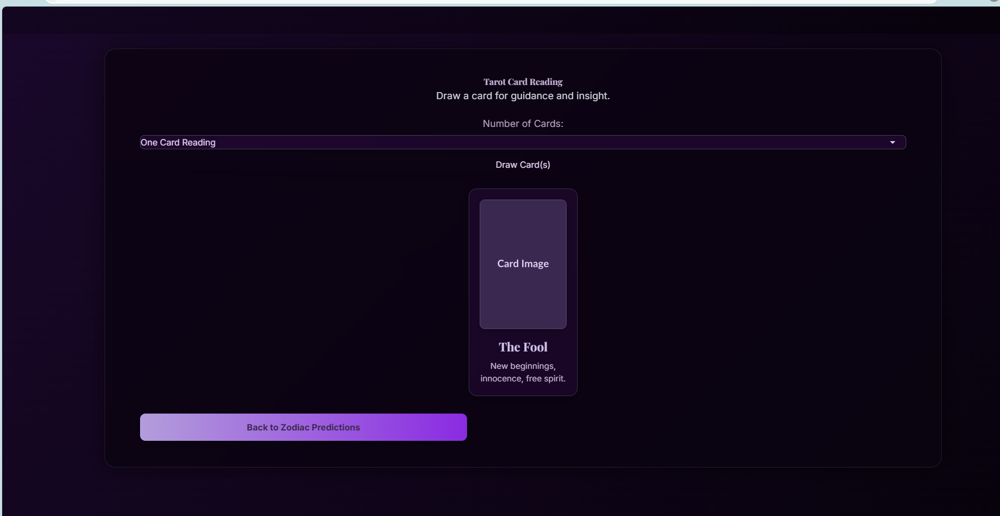
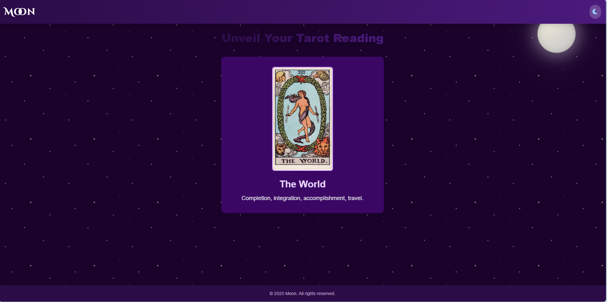
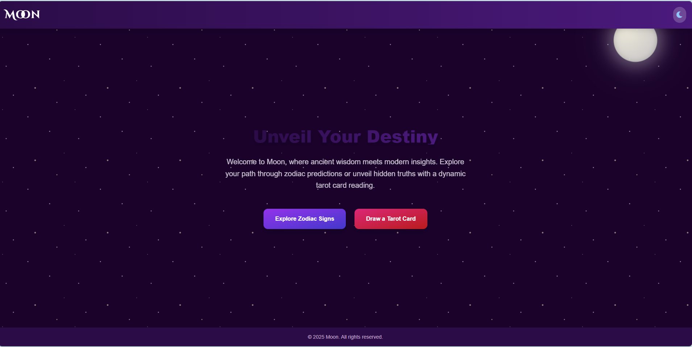
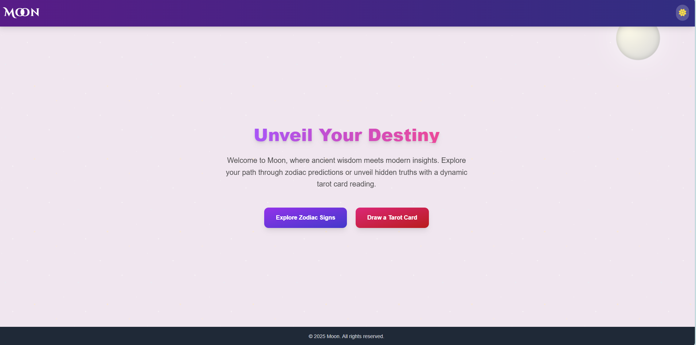
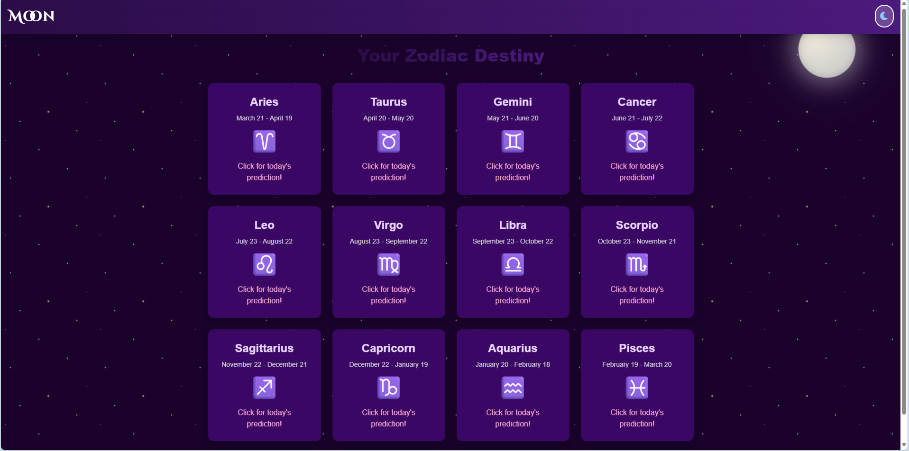
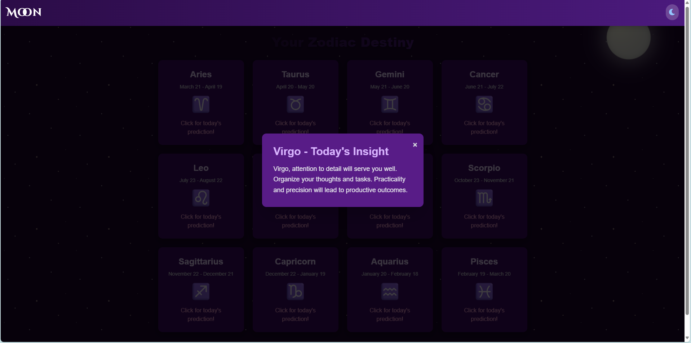
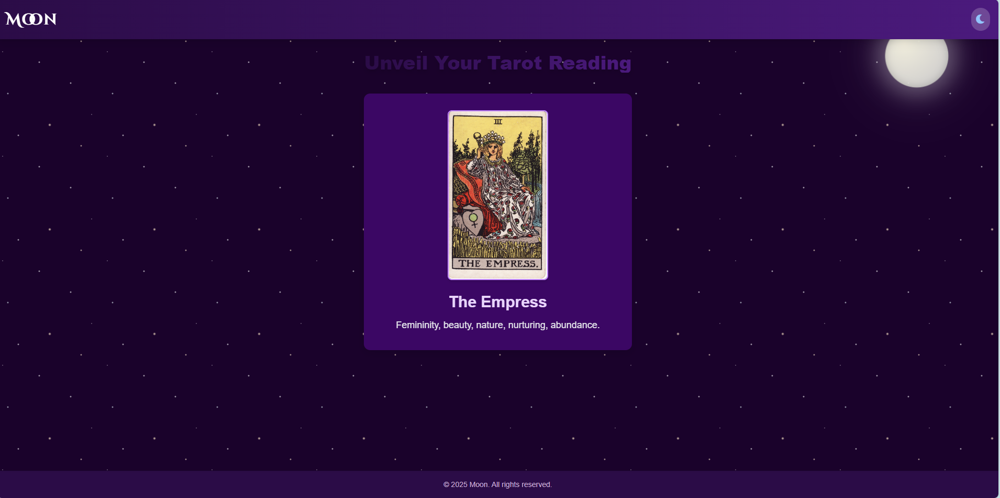

# 🌙 Moon - Zodiac & Tarot Mystic Portal

**Moon** is a celestial web application built with Flask that offers personalized **zodiac predictions** and dynamic **tarot card readings**. Designed with an aesthetic **dark mode toggle** and a **starry cosmic background**, it creates an immersive and intuitive journey to explore your destiny.

---

## 🔮 Table of Contents
- [✨ Features](#-features)  
- [🚀 Setup & Installation](#-setup--installation)  
- [▶️ Usage](#️-usage)  
- [📸 Screenshots](#-screenshots)  
- [🛠️ Technologies Used](#-technologies-used)  
- [📄 License](#-license)  
- [📞 Contact](#-contact)  

---

## ✨ Features
- 🌌 **Zodiac Predictions**  
  Get daily insights for all twelve zodiac signs. Click on any sign to reveal its personalized message.  
- 🃏 **Dynamic Tarot Card Pulling**  
  Draw a single card from a virtual tarot deck and see its mystical meaning.  
- 🌠 **Aesthetic UI**  
  Visually captivating with a cosmic theme and dynamic starry background.  
- 🌙☀️ **Dark Mode Toggle**  
  Seamlessly switch between light and dark themes using the toggle icon at the top-right corner.  
- 📱💻 **Responsive Design**  
  Fully optimized for mobile, tablet, and desktop experiences.  
- ➡️ **Smooth Navigation**  
  Easily jump between the Zodiac and Tarot sections via the landing page.  

---

## 🚀 Setup & Installation

Follow these steps to run the "Moon" app locally:

### 🔧 Prerequisites
- Python 3.x  
- pip  
- git  

### 📥 Clone the Repository
```bash
git clone https://github.com/rajatmishra1809/Moon.git
cd Moon
```

### 🧪 Create Virtual Environment
```bash
python -m venv venv
```

### ✅ Activate Virtual Environment

**Windows:**
```bash
.env\Scriptsctivate
```

**macOS/Linux:**
```bash
source venv/bin/activate
```

### 📦 Install Dependencies
```bash
pip install -r requirements.txt
```

> Make sure your `requirements.txt` includes:
```ini
Flask==2.2.3
```

---

## ▶️ Usage

### 🚀 Run the App
```bash
flask run
```
or
```bash
python app.py
```

### 🌐 Access in Browser
Open the app at:  
[http://127.0.0.1:5000/](http://127.0.0.1:5000/)

---

### 💫 Explore Features
- 🔯 Click **Explore Zodiac Signs** to see predictions for all signs  
- 🎴 Click **Draw a Tarot Card** to receive a random card reading  
- 🌓 Use the **sun/moon icon** to switch between light and dark themes  

---

## 📸 Screenshots

  
  
  
  
  
  


---

## 🛠️ Technologies Used
- **Backend**: Python + Flask 🐍  
- **Frontend**: HTML, Tailwind CSS 💅  
- **JavaScript**: For interactivity ✨  
- **Fonts**: Google Fonts (`Cinzel Decorative`, `Inter`) 🖋️  
- **Icons**: Font Awesome 🌟  

---

## 📄 License

This project is licensed under the **MIT License**.  
Feel free to modify, use, and distribute. ©️

---

## 📞 Contact

**Rajat Mishra**  
📧 Email: [mishrarajat156@gmail.com](mailto:mishrarajat156@gmail.com)  
🐙 GitHub: [github.com/rajatmishra1809](https://github.com/rajatmishra1809)

---

> ✨ *Let the stars guide you, and the moon light your path...* 🌙
